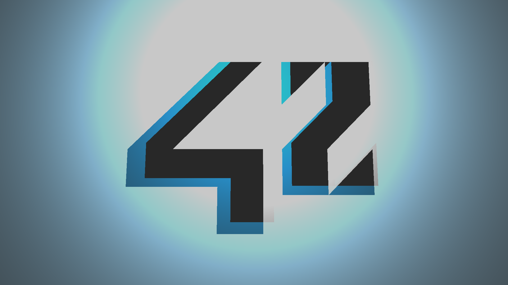
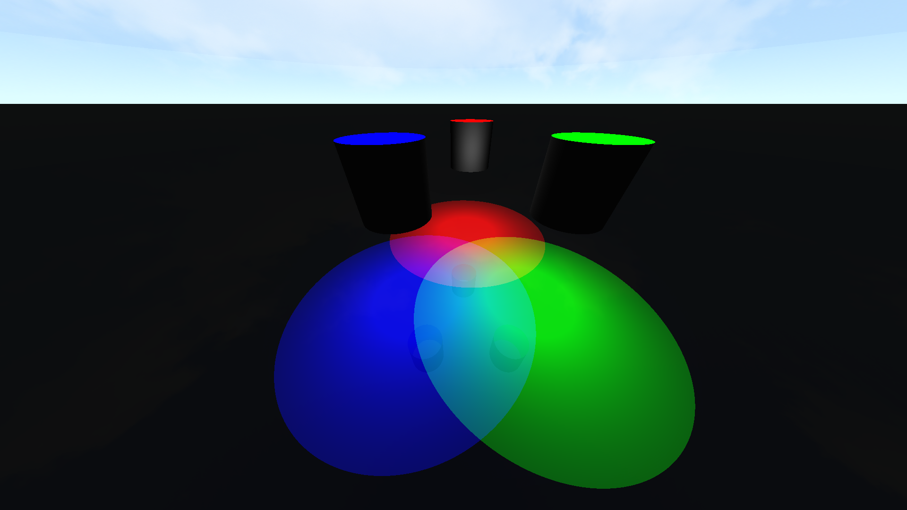
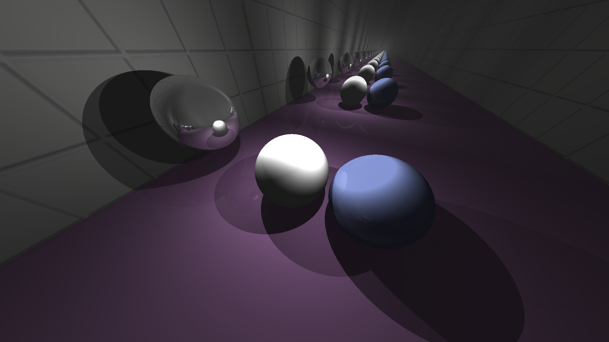
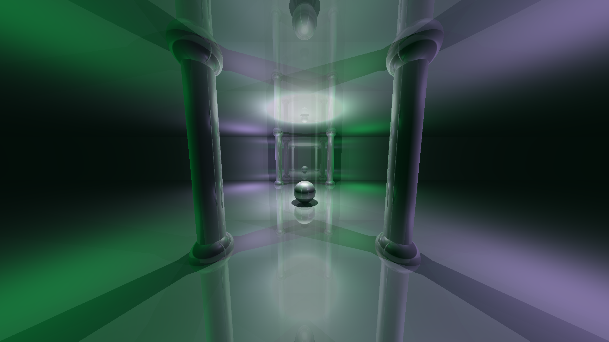
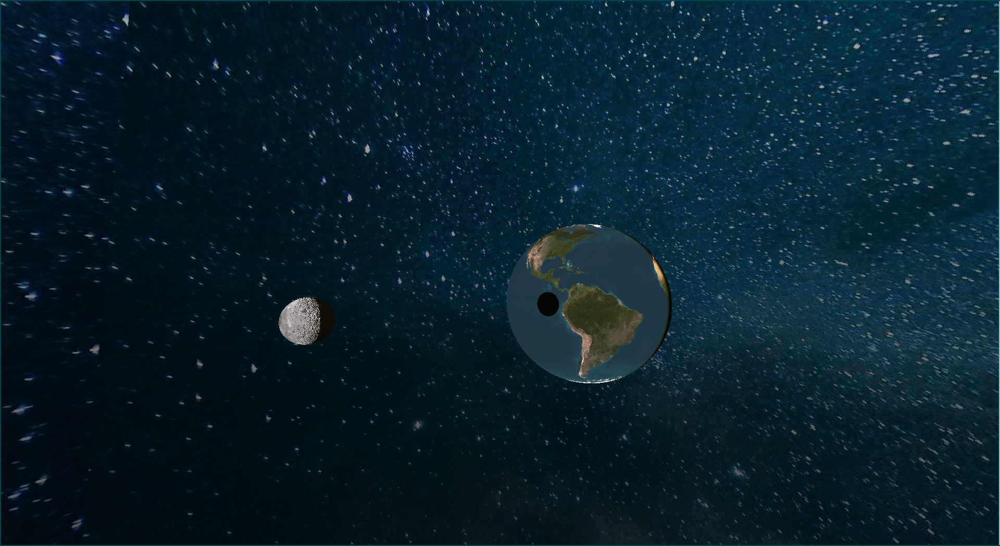
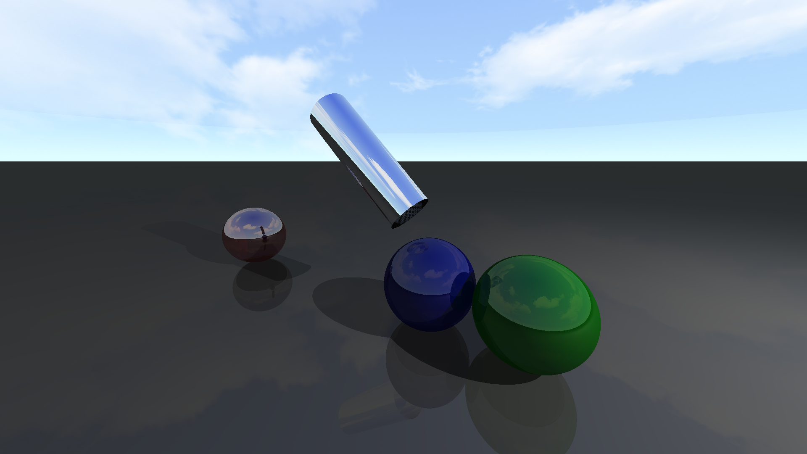

# miniRT

A simple raytracer written in C using the MLX42 library. This project is part of the 42 school curriculum.

## Description

miniRT is a basic raytracer that renders 3D scenes with various geometric objects, lighting, and materials. It supports real-time camera controls and advanced features like reflections, textures, and bump mapping.

## Features

- **Geometric Objects**: Spheres, planes, cylinders, and triangles
- **Lighting**: Multiple light sources with Phong shading model
- **Materials**:
  - Reflective surfaces
  - Texture mapping
  - Bump mapping
- **Camera Controls**:
  - Real-time camera movement (WASD)
  - Mouse-based camera rotation
  - Adjustable FOV
- **Scene Parsing**: Custom `.rt` file format for scene description
- **Skybox**: Support for skybox textures

## Scene File Format

Scene files use the `.rt` extension and support the following elements:

- `A`: Ambient lighting (ratio, RGB color)
- `C`: Camera (position, orientation, FOV)
- `S`: Sky/Skybox (color up, color down, optional texture)
- `l`: Light source (position, brightness ratio, RGB color)
- `sp`: Sphere (position, diameter, RGB color, reflection)
- `pl`: Plane (position, normal vector, RGB color, reflection)
- `cy`: Cylinder (position, axis, diameter, height, RGB color, reflection)
- `tr`: Triangle (3 vertices, RGB color, reflection)

### Textures and Bump Mapping

Objects can have textures and bump maps applied to them.

Example with a sphere:

```
sp  0,920,0  5  255,255,255  0.01  T: textures/moon.png  B: textures/moon_bump.png
```

- `T:` followed by a path specifies a texture file
- `B:` followed by a path specifies a bump map file

## Gallery

### 42 Logo Scene



### Light Demo



### Mirror Scene



### Room Scene



### Space Scene



### Test Scene



## Building

```bash
make
```

This will compile the program along with the required libraries:

- MLX42 (graphics library)
- libft (custom C library)
- kdm (3D math library)

## Usage

```bash
./miniRT <scene_file.rt>
```

Example:

```bash
./miniRT scene/test.rt
```

## Controls

- **WASD**: Move camera (forward, left, backward, right)
- **Space**: Move camera up
- **Ctrl**: Move camera down
- **Mouse**: Hold left click and drag to rotate camera view
- **ESC**: Exit program

## Dependencies

- GLFW
- CMake
- OpenGL libraries (libdl, pthread, lm)
